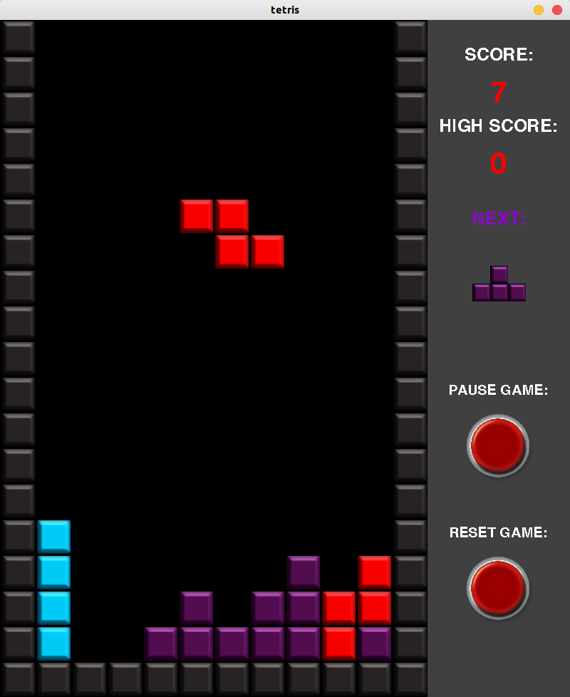
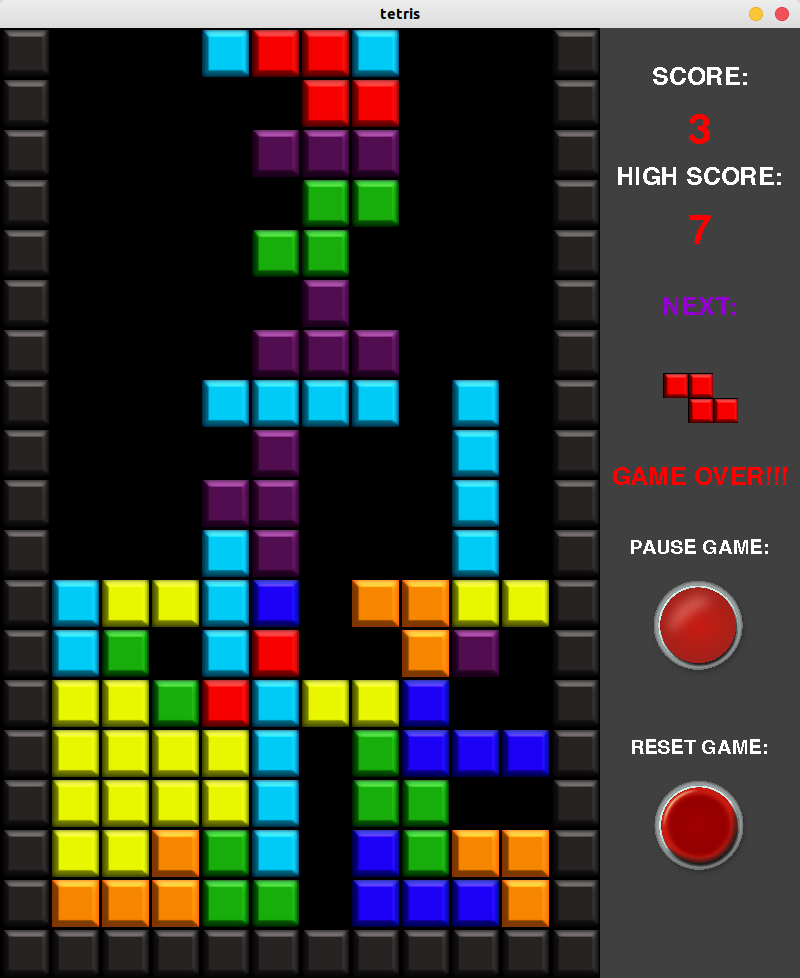

## Basic Tetris Game

There is really nothing more than just a tetris game. But the code is kind of a mess. Mwahahaha.

## How:

0. Install Python3 which comes with ``pip``

1. Upgrade ``pip``

```
>> pip3 install --upgrade pip
```
2. Go to the root folder of the project and run:

```
>> pip3 install -r requirements.txt
>> python3 tetris.py
```




